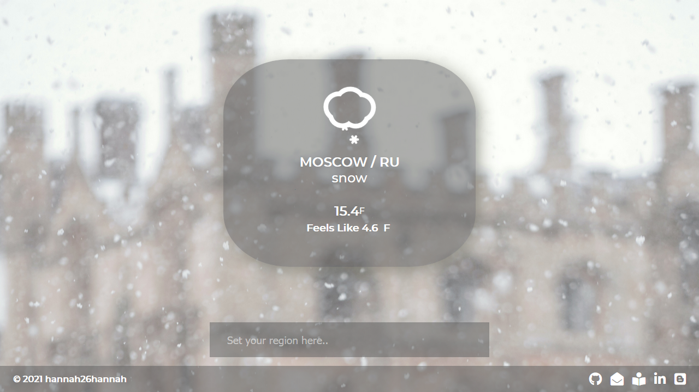
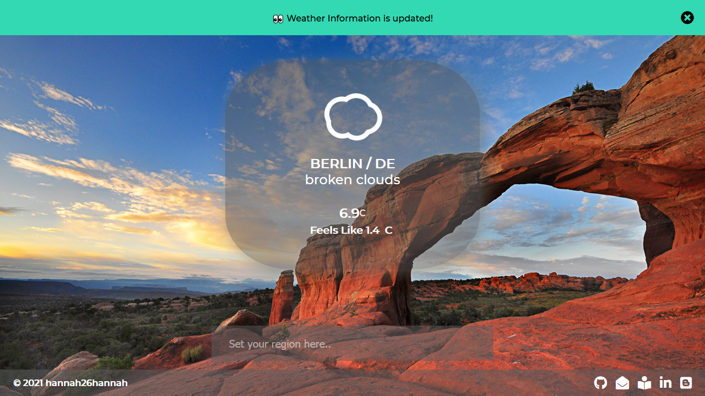

# Weather-app
Simple weather app displaying matching background iamges.
Built with vanilla JavaScript

Used Open API & Assets
- [OpenWeather](https://openweathermap.org/)
- [Unsplash](https://unsplash.com/)
- [Skycon](https://darkskyapp.github.io/skycons/)

# Goal 
Practice vanilla JavaScript events & fetching open APIs

# Feature
- When broswer is loaded, it gets user's current location and return matchy weather information
- After getting weather information, it finds matchy background image according to description of current weather
- User also can browse city name

[DEMO]()

# Preview

